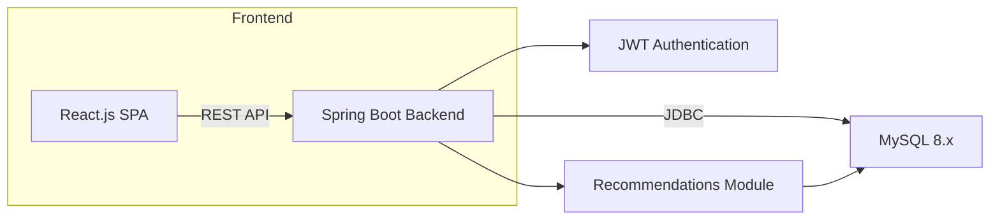

# TravelMate: A Booking Copycat

<a id="readme-top"></a>

<p align="center">
  
  
  
  
  
</p>

## Table of Contents

1. [Project Overview](#project-overview)
2. [Contributors](#contributors)
3. [Key Features](#key-features)
4. [Tech Stack & Architecture](#tech-stack--architecture)
5. [Installation & Setup](#installation--setup)
6. [Database Configuration](#database-configuration)
7. [Sample Credentials](#sample-credentials)
8. [Usage & Demo](#usage--demo)
9. [Recommendations Engine](#recommendations-engine)
10. [Roadmap & Future Work](#roadmap--future-work)

## Project Overview

TravelMate is a full-stack web application that replicates the key functionalities of a leading accommodation booking platform. The project demonstrates integration of a modern React.js frontend, a Spring Boot backend, a MySQL database, and a custom recommendations module. TravelMate supports client and landlord workflows, secure authentication, booking management, and future scalability.

<p align="right">(<a href="#readme-top">Back to the top</a>)</p>

## Contributors

* **Konstantinos Leontiadis** [Leone-GLorioso](https://github.com/Leone-Glorioso)
* **Dimitris Anagnostopoulos** [Dimitris_an](https://github.com/sdi2100002)

<p align="right">(<a href="#readme-top">Back to the top</a>)</p>


## Key Features

* **User Authentication & Roles**: Secure registration and login for Clients, Landlords, and Administrators using JWT tokens.
* **Property Search & Filters**: Date pickers, amenity filters, and price range sliders for precise search results.
* **Booking Workflow**: One-click booking, booking history, and post-stay reviews and ratings.
* **Landlord Dashboard**: Property management (create, read, update, delete), booking overviews, and basic analytics.
* **Admin Panel**: System-wide management of users, properties, bookings, and landlord approval requests.
* **Messaging System**: In-app messaging between registered users.
* **Recommendations Engine**: Heuristic-based suggestion mechanism with plans for machine learning enhancements.

<p align="right">(<a href="#readme-top">Back to the top</a>)</p>

## Tech Stack & Architecture



* **Frontend:** Was created using React.js and includes a login system that interacts with the backend in order to ensure protection, an effective search page of properties, a property page that allows only registered users to book, complete booking system and finally a management system for the manager of the page that makes available different statistics and enables user adding and deletion
* **Backend:** Was created using Spring Boot and includes complete interaction with the database, encrypted verification of info of the clients, actions throught the website and complete control of the data by the managing entity
* **Database:** Was created using MySQL and is a complete database with intact relational logic and complete entity management
* **Recommendations System:** In Java that, although not using machine learning methods, is highly effected when tested on a sample of rooms.


<p align="right">(<a href="#readme-top">Back to the top</a>)</p>

## Installation & Setup

1. **Clone the repository**

   ```bash
   git clone https://github.com/Leone-Glorioso/TravelMate.git
   cd TravelMate
   ```
2. **Backend Configuration**

   * Open the `travel_website_2_backend` directory in your IDE.
   * Create or update `src/main/resources/application.properties`:

     ```properties
     spring.datasource.url=jdbc:mysql://localhost:3306/greek_tours_db
     spring.datasource.username=<YOUR_DB_USER>
     spring.datasource.password=<YOUR_DB_PASSWORD>
     spring.jpa.hibernate.ddl-auto=update
     jwt.secret=<YOUR_JWT_SECRET>
     jwt.expirationMs=86400000
     ```
   * Build and run the application:

     ```bash
     ./mvnw spring-boot:run
     ```
3. **Database Setup**

   * Import `tedy_database.sql` using MySQL Workbench or command line.
   * Confirm that the `greek_tours_db` schema contains all tables and sample data.

<p align="right">(<a href="#readme-top">Back to the top</a>)</p>

## Database Configuration

1. Open MySQL Workbench.
2. Select **Data Import**, choose `tedy_database.sql`, and start the import.
3. In your IDE, configure a new MySQL data source with the connection details and verify the connection.

<p align="right">(<a href="#readme-top">Back to the top</a>)</p>

## Sample Credentials

Use the following credentials for testing:

| Role          | Username | Password  |
| ------------- | -------- | --------- |
| Administrator | admin    | admin1234 |
| Client        | Green    | Green1234 |
| Client        | BlueSky  | Sky789    |
| Landlord      | Jake     | Jake1234  |

Refer to the database scripts for additional accounts.

<p align="right">(<a href="#readme-top">Back to the top</a>)</p>

## Usage & Demo

1. Navigate to the home page and perform a search by selecting dates.
2. Review the list of available properties and apply filters as needed.
3. View property details and proceed to book a room.
4. After stay completion, submit a review and rating.
5. Access the dashboard corresponding to your user role for management and analytics.

<p align="right">(<a href="#readme-top">Back to the top</a>)</p>

## Recommendations Engine

The current implementation uses a heuristic score computed as the product of average rating and occupancy factor. Planned enhancements include:

* Collaborative filtering using user similarity metrics.
* Content-based recommendations based on property features.
* Machine learning models, including embedding-based ranking algorithms.

<p align="right">(<a href="#readme-top">Back to the top</a>)</p>

## Roadmap & Future Work

* **Machine Learning Integration**: Replace heuristics with trained recommendation models.
* **Image Upload Functionality**: Allow landlords to upload property images.
* **Performance Optimization**: Implement pagination, caching, and asynchronous processing.
* **Security Enhancements**: Add SSL/TLS, OAuth2 support, and role-based access controls.
* **Containerization**: Provide Docker and Kubernetes configurations.
* **Internationalization**: Support multiple languages through i18n.

<p align="right">(<a href="#readme-top">Back to the top</a>)</p>
